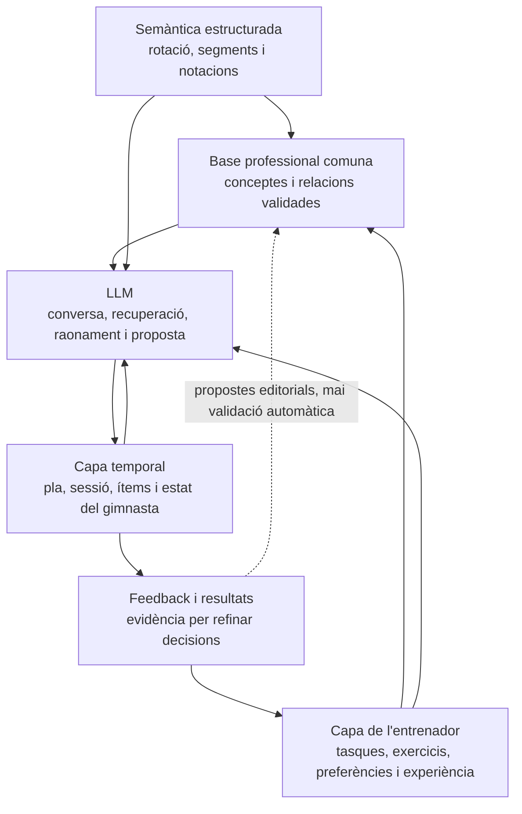
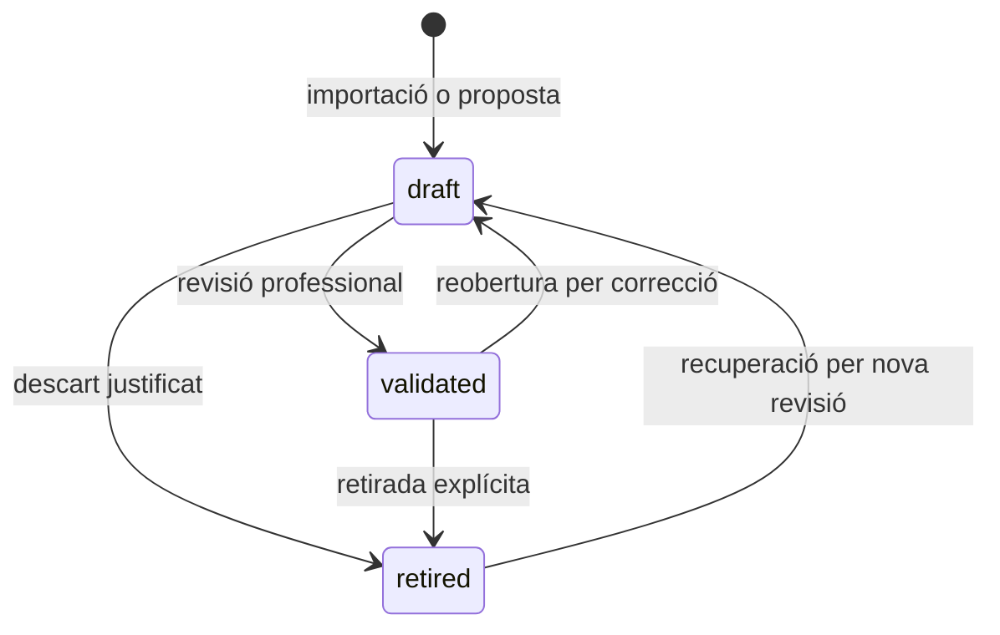

# Arquitectura de la base de coneixement d'IA Train

> **Estat del document:** font canònica del subsistema de coneixement d'IA Train  
> **Actualitzat:** 18 d'agost de 2026  
> **Abast:** base professional comuna, semàntica dels elements, coneixement propi de l'entrenador, estat temporal del gimnasta, planificació, aprenentatge i interacció amb l'LLM.

## 1. Propòsit i criteri de lectura

Aquest document explica de manera autosuficient com s'està construint la base de coneixement sobre la qual IA Train haurà de raonar i generar entrenaments de trampolí. Ha de permetre que una persona o un agent nou entengui:

- quines capes de coneixement existeixen;
- què està implementat avui i què només està dissenyat;
- què és coneixement professional compartit i què és propi d'un entrenador;
- com es representen els elements, les posicions, els contactes, la rotació i la notació;
- com s'ha d'ampliar la base sense convertir-la en un catàleg rígid;
- quin paper té l'LLM i quines decisions no se li han de delegar.

Quan aquest document entri en conflicte amb descripcions més antigues de `KnowledgeConcept`, `KnowledgeRelation`, `TrainingContext` o del graf dins de `docs/arquitectura_iatrain_mvp.md`, aquest document preval per al subsistema de coneixement d'IA Train.

L'arquitectura del subgraf anatòmic-cinemàtic, el corpus multivídeo i la separació entre identitat de l'element i qualitat d'execució es desenvolupa a [`arquitectura_coneixement_anatomic_cinematic_iatrain.md`](arquitectura_coneixement_anatomic_cinematic_iatrain.md). L'inventari de la primera implementació —vocabulari, esquelet canònic, govern, límits i passos següents— viu a [`implementacio_graf_anatomic_esquelet_cinematic_iatrain.md`](implementacio_graf_anatomic_esquelet_cinematic_iatrain.md).

Les afirmacions s'han de llegir amb tres estats diferents:

- **Construït:** existeix als models, serveis, importadors o interfícies actuals.
- **Decidit:** és una decisió arquitectònica que encara no té tota la implementació.
- **Proposat:** és una direcció prevista que s'ha de validar abans de programar-la.

## 2. Idea essencial

IA Train no ha de generar entrenaments a partir d'una llista tancada de registres predefinits. El sistema combina:

1. una base professional comuna i governada;
2. dades estructurades que descriuen amb precisió els elements;
3. una futura capa de tasques, exercicis i preferències pròpia de cada entrenador o organització;
4. l'estat temporal de cada gimnasta;
5. la planificació i el que s'ha de treballar en una sessió concreta;
6. el raonament conversacional de l'LLM.

No hi haurà una còpia completa del graf professional per a cada entrenador. Hi haurà **un graf professional compartit** i, connectada a aquest, **una capa d'ús pròpia de l'entrenador**. Això permet reutilitzar la veritat estable de l'esport sense imposar que tots els entrenadors treballin amb els mateixos exercicis, progressions o consignes.

## 3. Les capes del coneixement

### 3.1. Capa professional comuna

**Estat: construïda en una primera versió.**

És el coneixement compartit que pretén descriure l'esport i no la manera particular d'entrenar d'una persona. Viu en un graf dirigit format per:

- `KnowledgeConcept`: node professional;
- `KnowledgeRelation`: aresta dirigida i tipada entre dos nodes.

Exemples de nodes professionals actuals:

- elements executables, com `Bot`, `Barani` o `Cody` (`kind=skill`);
- posicions de vol: agrupada, carpada i en planxa (`kind=body_position`);
- formes de contacte amb el trampolí: dempeus, assegut, de pit, d'esquena i de quatre potes (`kind=contact_position`).

Exemples d'arestes actuals:

- `requires`: un concepte en requereix un altre;
- `has_defining_position`: la posició forma part de la identitat d'aquell element concret;
- `starts_from_contact`: configuració corporal de sortida;
- `ends_in_contact`: configuració corporal d'arribada.

El model ja reserva vocabulari extensible per a components tècnics, errors, qualitats, riscos, objectius i altres relacions com `progresses_to`, `corrects`, `conditions` o `trains`. Que un tipus consti al codi no significa que ja hi hagi coneixement validat d'aquell tipus.

La base comuna és **governada**, no literalment immutable. Pot créixer, corregir-se i retirar contingut, però qualsevol canvi ha de passar pel procés editorial. Les dades validades no s'han de modificar implícitament com a conseqüència d'una conversa o d'un únic entrenament.

### 3.2. Capa semàntica estructurada dels elements

**Estat: construïda per a rotació i notació.**

No tota la informació professional encaixa bé com a nodes i arestes. Les magnituds exactes, l'ordre i la interpretació d'una notació necessiten estructura relacional i validacions deterministes. Per això existeix una capa vinculada als nodes `skill`, però separada del graf:

- `ElementRotation`: perfil canònic d'un element, amb quarts de rotació transversal i direcció;
- `ElementRotationSegment`: migs girs longitudinals ordenats dins dels segments de la rotació;
- `ElementNotation`: representació escrita original i normalitzada, esquema, estat d'interpretació i procedència de les inferències.

Aquesta separació és intencionada:

- el node respon **quin element és**;
- les relacions responen **amb quins conceptes professionals està connectat**;
- el perfil de rotació respon **quina estructura mecànica té**;
- la notació respon **com s'ha escrit o codificat aquella estructura**.

La notació és una serialització, no la identitat única de l'element. Un mateix element pot arribar a tenir més d'una notació segons esquema o versió.

La base professional és, per tant, **híbrida**: el graf representa conceptes reutilitzables i relacions estables, però no ha de contenir tota la definició d'un element. La futura descripció temporal i corporal viurà en una especificació professional vinculada a l'element, conceptualment `ElementMotionSpecification`.

Aquesta especificació podrà dividir el moviment en sortida, execució, obertura i aterratge, amb l'ordre, els límits, les accions anatòmiques, la importància tècnica i els criteris d'execució corresponents. Aquestes fases seran parts estructurades de la definició de cada element, **no `KnowledgeConcept` del graf tècnic per defecte**. El node `Barani` continuarà representant l'element; la seva especificació explicarà com es desenvolupa en el temps.

Els contactes, la posició i la rotació continuen descrivint la identitat tècnica sense haver de quedar subordinats a nodes de fase. La pantalla del graf podrà mostrar en el futur connexions amb les especificacions, però una projecció visual no converteix necessàriament totes les dades en `KnowledgeRelation`.

### 3.3. Capa pròpia de l'entrenador

**Estat: decidida, encara no implementada.**

Un exercici o `TrainingTask` és un concepte ampli. Pot ser:

- un element oficial;
- un enllaç o una seqüència;
- una progressió;
- una preparació física o tècnica;
- un moviment inventat;
- una consigna particular d'un entrenador;
- una combinació amb material, ajudes o condicions concretes.

Aquest contingut no s'ha d'introduir automàticament al graf professional. Moltes tasques només tenen sentit per a un entrenador, un club o una metodologia. La futura capa haurà de tenir propietari i abast —personal, d'organització o compartit— i podrà apuntar als nodes professionals pertinents.

Per exemple, una tasca privada «Barani des de lona baixa amb referència visual» podria:

- estar creada i preferida per un entrenador concret;
- apuntar al node professional `Barani`;
- entrenar un component tècnic concret;
- corregir un error observat;
- conservar instruccions, variants i condicions locals;
- acumular evidència d'ús sense alterar la definició professional de `Barani`.

Quan existeixin les especificacions de moviment, una tasca també podrà apuntar a una fase concreta de l'especificació, una acció anatòmica o un error professional. Aquest enllaç permetrà expressar «aquesta tasca treballa l'obertura del Barani» sense convertir la tasca en coneixement professional comú ni convertir la fase en un node del graf tècnic.

La capa de l'entrenador podrà formar un **overlay o subgraf d'ús**, però no serà una còpia ni una bifurcació del graf professional.

### 3.4. Capa operativa i temporal

**Estat: dissenyada conceptualment, pendent dels models principals.**

La unitat operativa inicial ha de ser `TrainingSession`. Una sessió contindrà `TrainingSessionItem` ordenats. Un ítem no s'ha de limitar necessàriament a «un exercici»: és una entrada executable de la sessió que podrà referenciar una tasca, un element, una seqüència, un bloc o una indicació, i afegir volum, durada, repeticions, descans, objectiu i adaptacions.

`TrainingPlan` serà una funcionalitat diferenciada per crear planificacions de temporada, mesocicle o microcicle. Estarà vinculada a un gimnasta o grup d'entrenament i permetrà que el generador consulti què toca treballar el dia de la sessió.

Ordre de construcció acordat:

1. `TrainingSession`;
2. `TrainingSessionItem`;
3. `TrainingPlan` i la seva vinculació amb gimnastes o grups;
4. altres models especialitzats només quan els casos reals ho exigeixin.

El model `TrainingContext` existeix al codi, però actualment està en desús i no està integrat en aquest flux. **No s'ha d'utilitzar com a fonament de les sessions, els plans o el coneixement nou.** `AthleteObservation` encara conserva una relació opcional amb aquest model per compatibilitat amb el disseny existent; aquesta dependència s'haurà de revisar quan s'implementin les sessions.

### 3.5. Estat temporal del gimnasta

**Estat: suport parcial construït; interpretació completa pendent.**

L'estat del gimnasta no ha de ser un conjunt rígid de caselles. Depèn de la sessió, el punt de la temporada, l'objectiu, la fatiga, la confiança, el treball recent i les observacions del moment. L'LLM haurà de construir una interpretació temporal a partir d'evidència, casos semblants i historial.

El model actual `AthleteObservation` permet conservar afirmacions narratives versionables sobre un gimnasta:

- categoria: competència, aprenentatge, fortalesa, dificultat, por o bloqueig, limitació o nota;
- estat: observat, en progrés, estable o no vigent;
- text narratiu i evidència observable;
- confiança opcional entre 0 i 1;
- intensitat opcional entre 1 i 5;
- moment d'observació, autoria i concepte professional relacionat;
- revisió no destructiva mitjançant `supersedes`.

Aquest registre històric ha de permetre explicar en el futur per què es va generar una sessió i comparar la decisió amb els resultats posteriors. No s'ha de confondre una observació datada amb una propietat permanent del gimnasta.

## 4. Model professional actual

### 4.1. Nodes: `KnowledgeConcept`

Cada node inclou:

- nom i descripció;
- `kind` extensible;
- disciplina;
- estat editorial;
- autor;
- `attributes` JSON per a procedència o extensions petites;
- dates de creació i actualització.

La unicitat actual és nom —sense distingir majúscules—, tipus i disciplina. `attributes` no s'ha d'utilitzar per amagar relacions entre conceptes ni per substituir camps de domini que necessiten consultes i validacions pròpies.

### 4.2. Arestes: `KnowledgeRelation`

Cada aresta inclou:

- node origen;
- node destí;
- tipus de relació;
- justificació narrativa (`rationale`);
- estat editorial;
- autor i dates.

Les arestes són dirigides. `A requires B` no equival a `B requires A`. No es permet una aresta d'un node cap a si mateix ni duplicar la mateixa combinació origen, destí i tipus.

La inexistència d'una aresta s'ha d'interpretar amb una política de **món obert**: pot significar que la relació encara no s'ha documentat, no pas que sigui falsa o impossible.

### 4.3. Posicions de vol

Les tres posicions professionals actuals són:

- posició agrupada, símbol `o`;
- posició carpada, símbol `<`;
- posició en planxa, símbol `/`.

L'element i la posició són conceptes diferents encara que el llenguatge natural comparteixi paraules. Per exemple, el concepte d'element `Agrupat` no és el mateix node que `Posició agrupada`. L'LLM ha de resoldre el sentit segons el tipus de node i el context de la conversa.

Un element executable es conserva com un node concret quan la posició en forma part de la identitat esportiva. Per tant, tres variants reals d'un mateix moviment poden ser tres elements diferents, cadascun connectat a la seva posició. No s'ha introduït ara una capa de «famílies d'elements», perquè encara no aporta una funció operativa prou clara.

`has_defining_position` només s'ha de crear quan la posició és una característica explícita de la identitat de l'element. Un valor genèric o incomplet del sistema antic no és prou evidència. En particular, `Cody` es pot executar en les tres posicions: el fet que el registre antic només el descrivís de manera general o amb una pista de posició no autoritza a fixar-ne una com a definitòria.

### 4.4. Contactes de sortida i arribada

Els nodes actuals de contacte són:

- dempeus;
- assegut;
- de pit;
- d'esquena;
- de quatre potes.

Es modelen separadament de la posició de vol. `starts_from_contact` descriu des de quina configuració corporal surt l'element i `ends_in_contact` com arriba al trampolí.

«De quatre potes» és coneixement vàlid per a progressions encara que no sigui una arribada oficial de competició. No s'ha de retirar editorialment per aquest motiu. La legalitat competitiva és una propietat contextual i versionada que s'haurà de modelar en una futura capa de regles.

## 5. Rotació i notació

### 5.1. Regla estructural

El parser actual interpreta la notació numèrica amb aquestes regles:

- el prefix numèric representa els quarts de rotació transversal;
- hi ha com a mínim un segment longitudinal;
- el nombre esperat de segments és `max(1, ceil(quarts / 4))`;
- cada dígit posterior representa migs girs longitudinals del segment corresponent;
- `0` i `-` representen zero migs girs;
- un punt inicial indica rotació transversal endavant;
- un punt després del component numèric indica rotació transversal enrere;
- `o`, `<` i `/` al final indiquen respectivament agrupat, carpat i planxat.

El parser prefereix una interpretació exacta. Si només hi ha un únic `0` o `-` per a una rotació de diversos segments, accepta la forma abreujada i l'expandeix.

Exemples:

| Entrada | Interpretació | Normalització |
|---|---|---|
| `12` | 1 quart transversal i 2 migs girs longitudinals | `12` |
| `.41o` | 4 quarts endavant, 1 mig gir, agrupat | `.41o` |
| `41.` | 4 quarts enrere, 1 mig gir, posició no resolta | `41.` |
| `813.<` | 8 quarts enrere, 1 mig gir al primer segment i 3 al segon, carpat | `813.<` |
| `70` | 7 quarts i cap gir als dos segments, forma abreujada | `700` |
| `720` | 7 quarts, 2 migs girs al primer segment i 0 al segon | `720` |
| `8--` | 8 quarts i zero migs girs als dos segments | `800` |
| `12000` | 12 quarts i zero migs girs als tres segments | `12000` |

És important que `12` **no** s'interpreti com un triple mortal. Seguint la regla de separació exacta, és un element d'1 quart amb 2 migs girs longitudinals.

### 5.2. Informació explícita, inferida i desconeguda

La notació pot ometre el punt de direcció o el símbol de posició. L'omissió no autoritza a inventar el valor. `ElementNotation` registra separadament si direcció i posició són:

- `explicit`: presents a la notació;
- `inferred`: deduïdes per una regla segura;
- `unknown`: encara no resoltes.

També conserva `raw_notation`, `normalized_notation`, si era abreujada, l'estat `parsed`, `ambiguous` o `invalid`, i detalls de procedència. Les pistes del sistema antic, com `body_shape`, es guarden com a evidència auxiliar, però no s'utilitzen per completar silenciosament una posició omesa.

El càlcul i la normalització s'han de fer amb el parser determinista de `iatrain/rotation_notation.py`, no amb raonament lliure de l'LLM. L'LLM pot explicar la notació, detectar que cal desambiguar-la o conversar sobre el resultat estructurat.

## 6. Govern editorial i procedència

Nodes, arestes i perfils de rotació utilitzen tres estats editorials:

- `draft`: proposta pendent de revisió;
- `validated`: coneixement acceptat per formar part de la base fiable;
- `retired`: coneixement conservat per historial però que ja no s'ha d'utilitzar com a vigent.

Flux esperat:

La validació és manual ara mateix. Totes les transicions operatives passen per `iatrain.editorial`, que aplica permisos, bloqueig transaccional, regles de transició i auditoria persistent. Els superusuaris governen nodes i arestes des de la pantalla del graf; els perfils de rotació es governen mitjançant accions de l'administració Django.

Per validar una aresta, primer han d'estar validats els dos nodes. Per validar un perfil de rotació, l'element ha d'estar validat i han d'existir exactament tots els segments esperats, ordenats i sense buits. Un node validat no es pot reobrir ni retirar mentre conservi arestes o un perfil de rotació validats connectats: primer s'han de reobrir o retirar les dependències.

`last_validated_by` i `last_validated_at` permeten consultar l'última validació de nodes, arestes i perfils. Cada canvi d'estat crea un `KnowledgeEditorialEvent` immutable amb actor, motiu i una captura del contingut revisat. L'auditoria de Django continua registrant també les accions fetes des del visor.

El contingut validat no es pot modificar silenciosament: primer s'ha de reobrir com a `draft`. L'única excepció és afegir procedència legacy de manera additiva, sense eliminar ni canviar procedència anterior ni modificar atributs professionals. Els models governats no es poden eliminar amb l'operativa ordinària; es retiren i es conserven per historial. Les observacions, rotacions i notacions protegeixen les seves referències professionals amb `PROTECT`.

`draft` no significa fals; significa que encara no ha superat la revisió. `retired` tampoc significa «prohibit en competició». L'estat editorial i la validesa segons reglament són dimensions diferents.

Qualsevol importació o proposta automàtica ha d'entrar com a esborrany. L'LLM no pot autovalidar coneixement professional.

## 7. Llegat de Tramponline

Tramponline s'utilitza com a inspiració de la intenció i com a font de dades a revisar, no com a model arquitectònic ni com a autoritat professional. El problema del sistema antic era derivar els entrenaments principalment de registres rígids de base de dades, cosa que limitava la variació i la qualitat de les decisions.

Les importacions actuals són idempotents, admeten `--dry-run`, exigeixen una persona autora i preserven conflictes amb contingut ja curat. Les comandes són:

- `import_legacy_main_elements`;
- `import_body_positions`;
- `import_contact_positions`;
- `import_rotation_notations`.

La procedència original es conserva a `attributes.legacy_sources`, a `ElementRotation.provenance` o a `ElementNotation.parse_details`, segons el tipus de dada. Importar no equival a validar.

Exemple conceptual d'una migració:

1. un registre antic de `Barani` crea o identifica el node professional `Barani` com a `skill` en esborrany;
2. la notació es passa pel parser i crea un perfil de rotació estructurat;
3. les posicions només es connecten si la identitat és explícita i no entra en conflicte amb coneixement més fiable;
4. els contactes de sortida i arribada es proposen com a arestes en esborrany;
5. l'identificador, el nom i els valors originals es conserven com a procedència;
6. una persona revisa els nodes i les arestes abans de validar-los.

## 8. Estat implementat a 18 d'agost de 2026

La base activa conté:

| Contingut | Quantitat | Estat editorial |
|---|---:|---|
| Nodes d'element (`skill`) | 47 | 46 esborranys, 1 validat (`Bot`) |
| Nodes de posició de vol | 3 | esborrany |
| Nodes de contacte | 5 | esborrany |
| Arestes `has_defining_position` | 34 | esborrany |
| Arestes `starts_from_contact` | 47 | esborrany |
| Arestes `ends_in_contact` | 47 | esborrany |
| Arestes `requires` | 3 | esborrany |
| Perfils `ElementRotation` | 47 | esborrany |
| Segments de rotació | 72 | vinculats als perfils |
| Notacions | 47 | interpretades; posició no resolta en totes 47 |

En total, el graf visual té **55 nodes i 131 arestes**. Les dades de rotació i notació no augmenten aquests recomptes perquè formen part de la capa estructurada vinculada als elements, no són nodes del graf.

Hi ha una pantalla 3D exclusiva per a superusuaris a `/iatrain/graf-coneixement/`. Permet:

- zoom d'entrada i sortida;
- translació arrossegant;
- rotació amb `Ctrl` + arrossegar;
- filtres de nodes, relacions i estat editorial;
- inspecció dels atributs, autoria, relacions i notació d'un element;
- canvi manual d'estat editorial de nodes i arestes amb les validacions descrites.

La visualització usa Canvas i no introdueix una base de dades de graf separada. El graf continua emmagatzemat a la base relacional de Django.

### 8.1. Allò que encara no existeix

- model de `TrainingTask` o capa pròpia de l'entrenador;
- `TrainingSession` i `TrainingSessionItem`;
- `TrainingPlan`;
- integració productiva amb un LLM;
- pesos apresos, confiança o força específica a `KnowledgeRelation`;
- historial de resultats de tasques i sessions acceptades;
- model normalitzat de fonts i evidències professionals;
- regles de competició versionades;
- càlcul formal de dificultat;
- catàleg professional complet o validat;
- relacions tècniques, progressions, errors i riscos amb cobertura suficient.

No s'ha de confondre un nom de tipus reservat al codi amb una funcionalitat ja disponible.

## 9. Contracte d'interacció amb l'LLM

L'LLM serà la interfície principal de conversa, interpretació contextual i raonament. No serà la base de dades ni l'autoritat que defineix unilateralment el coneixement professional.

Per generar una sessió, el flux previst és:

1. identificar entrenador, gimnasta o grup i permisos;
2. consultar el pla aplicable a la data, si existeix;
3. reconstruir l'estat temporal del gimnasta a partir de les observacions vigents i l'historial rellevant;
4. recuperar del graf els elements, prerequisits, contactes, posicions, components tècnics, riscos i progressions pertinents;
5. recuperar les tasques i preferències de l'entrenador que s'hi relacionen;
6. construir una proposta de sessió amb ítems concrets i justificacions traçables;
7. conversar, adaptar i demanar aclariments només quan l'ambigüitat sigui material;
8. desar la sessió acceptada i posteriorment el feedback i els resultats.

L'LLM ha de distingir sempre entre:

- **fet validat:** procedeix de la base professional validada;
- **dada estructurada:** resultat del parser o d'una regla determinista;
- **observació:** afirmació datada sobre un gimnasta;
- **preferència o experiència:** coneixement d'un entrenador o organització;
- **inferència:** conclusió contextual del model, que ha de poder explicar;
- **proposta:** contingut encara no acceptat ni validat.

Regles de seguretat epistemològica:

- no inventar una aresta perquè «sembla probable»;
- no interpretar una absència al graf com una prohibició;
- no convertir una observació en un estat permanent;
- no exposar dades privades d'un entrenador o gimnasta fora del seu abast;
- no usar l'LLM per substituir parsers, restriccions de base de dades o comprovacions de permisos;
- no validar nodes o arestes professionalment sense revisió humana;
- explicar quines dades han condicionat una generació d'entrenament.

## 10. Com aprendrà el sistema

L'aprenentatge no ha de consistir a reescriure directament el graf professional després de cada interacció. Ha de separar tres velocitats de canvi:

### Velocitat 1: estat immediat

Canvia entre sessions o fins i tot dins d'una sessió: fatiga, confiança, bloqueig, dolor, qualitat observada o disponibilitat. Alimenta la decisió actual, però no redefineix l'esport.

### Velocitat 2: experiència de l'entrenador

S'acumula amb l'ús: quines tasques prefereix, en quins contextos les considera bones, per a quins perfils funcionen i amb quins resultats. Aquesta evidència ha de refinar el seu overlay i la importància relativa de les opcions per a aquell abast.

### Velocitat 3: coneixement professional

Canvia lentament i amb govern editorial. Molts casos consistents poden originar una proposta de nova relació, una correcció o un canvi de força, però primer s'ha de conservar l'evidència i crear una proposta revisable. Només després de validació passa a la base comuna.

Quan s'implementin pesos o confiança, no s'ha de sobrecarregar una única xifra. Com a mínim caldrà distingir:

- validesa professional de la relació;
- força o rellevància segons context;
- preferència pròpia de l'entrenador;
- quantitat i qualitat de l'evidència;
- vigència temporal;
- versió del reglament o disciplina aplicable.

## 11. Com ha de créixer la base

L'ordre recomanat és guiat pels casos d'ús de generació de sessions, no per l'ambició de completar una ontologia sencera abans de tenir producte.

### Fase següent: consolidar la base professional

- revisar i validar gradualment els 47 elements importats;
- completar direcció i posició només amb evidència fiable;
- contrastar contactes amb les regles de quarts de rotació;
- afegir relacions de prerequisit i progressió útils;
- començar components tècnics, errors freqüents, correccions i riscos;
- revisar la primera base anatòmica i l'esquelet canònic, mapar-hi el tracker real i preparar un primer tall vertical segons [`implementacio_graf_anatomic_esquelet_cinematic_iatrain.md`](implementacio_graf_anatomic_esquelet_cinematic_iatrain.md);
- normalitzar fonts, justificacions i procedència;
- separar legalitat competitiva i versions de reglament de l'estat editorial.

### Fase operativa: sessions

- introduir `TrainingSession` i `TrainingSessionItem`;
- definir com un ítem referencia elements o futures tasques sense perdre la versió executada;
- desar autoria, ordre, càrrega prevista, adaptacions i justificació de generació;
- registrar resultat i feedback amb prou estructura per reaprendre.

### Fase de personalització: tasques de l'entrenador

- introduir `TrainingTask` amb propietari i abast;
- permetre seqüències, variants, consignes, material i condicions;
- connectar-les als conceptes professionals sense promocionar-les automàticament;
- aprendre preferències i eficàcia contextual a partir de sessions reals.

### Fase de planificació

- introduir `TrainingPlan` per temporada, mesocicle i microcicle;
- vincular-lo a gimnastes o grups;
- fer que la sessió consulti els objectius del dia sense quedar determinada rígidament pel pla;
- conservar revisions i desviacions justificades.

### Fase de raonament i aprenentatge

- recuperar subgrafs rellevants per a cada decisió;
- comparar casos semblants respectant permisos i abast;
- proposar sessions explicables;
- convertir feedback en evidència;
- crear propostes editorials quan apareguin patrons professionals repetits.

## 12. Protocol per a futurs agents

Abans de crear o modificar coneixement, un agent ha de seguir aquest ordre:

1. **Classificar la dada.** És una veritat professional, semàntica estructurada, una tasca de l'entrenador, una observació temporal o una dada de sessió?
2. **Buscar abans de crear.** Comprovar si ja existeix el concepte pel nom, tipus i disciplina, i cercar sinònims o nodes relacionats.
3. **No barrejar capes.** Una preferència no és una aresta professional; una notació no és un node; una observació no és una propietat immutable.
4. **Preservar la incertesa.** Si direcció, posició o relació no estan justificades, deixar-les desconegudes o en esborrany.
5. **Usar lògica determinista quan existeix.** La notació passa pel parser; els permisos i les restriccions passen pels serveis i models.
6. **Conservar autoria i procedència.** Cap proposta professional ha de quedar sense rastre de l'origen.
7. **Crear com a esborrany.** Importacions, inferències i propostes automàtiques no entren validades.
8. **No destruir historial.** Les observacions es revisen per substitució i els conceptes es retiren, no s'esborren per conveniència.
9. **Explicar la decisió.** Una sessió generada ha de poder indicar pla, observacions, preferències i relacions que l'han condicionada.
10. **Verificar amb casos límit.** Especialment notacions abreujades, termes amb més d'un sentit, elements disponibles en diverses posicions i regles de competició versionades.

## 13. Mapa del codi rellevant

- `iatrain/models.py`: models del graf, rotació, notació, observacions i `TrainingContext` heretat.
- `iatrain/editorial.py`: transicions editorials, bloquejos, regles de dependència i auditoria durable.
- `iatrain/identity.py`: consolidació de totes les dades d'IA Train quan Core fusiona dues persones.
- `iatrain/services.py`: creació validada de conceptes i relacions, permisos i revisions d'observacions.
- `iatrain/rotation_notation.py`: parser determinista i normalització de la notació.
- `iatrain/legacy_imports/`: transformacions conservadores des de Tramponline.
- `iatrain/management/commands/import_*.py`: entrada dels importadors des de Django.
- `iatrain/views/knowledge_graph.py`: dades del graf i govern editorial des de la pantalla 3D.
- `iatrain/static/iatrain/knowledge_graph.js`: interacció i renderització 3D amb Canvas.
- `iatrain/templates/iatrain/knowledge_graph/`: interfície de supervisió.
- `iatrain/tests/test_knowledge_graph.py`: permisos, serialització i transicions editorials.
- `iatrain/tests/test_rotation_notation.py`: regles i casos límit del parser.
- `iatrain/tests/test_rotation_notation_import.py`: importació, idempotència i conflictes de notació.
- `docs/arquitectura_coneixement_anatomic_cinematic_iatrain.md`: arquitectura canònica del coneixement anatòmic, cinemàtic, normatiu i del corpus de vídeo.
- `docs/implementacio_graf_anatomic_esquelet_cinematic_iatrain.md`: estat real del subgraf i de l'esquelet canònic, fronteres dels models i full de ruta immediat.

## 14. Resum de decisions no negociables actuals

- El graf professional és comú; no hi ha un graf complet diferent per entrenador.
- Els elements executables són nodes professionals concrets.
- Posició de vol i contacte amb el trampolí són conceptes diferents.
- Les variants en posicions que compten com a elements diferents poden viure com a nodes diferents.
- No s'introdueixen famílies d'elements fins que tinguin una utilitat operativa clara.
- Rotació i notació formen una capa estructurada vinculada als elements, no una proliferació de nodes.
- La base professional és híbrida: el graf no és l'únic contenidor de coneixement.
- Les fases són parts ordenades d'una futura `ElementMotionSpecification`, no nodes normals del graf tècnic per defecte.
- Les tasques i preferències de l'entrenador viuran en una capa pròpia connectada al graf.
- L'estat del gimnasta és temporal, narratiu i reconstruït segons el context.
- `TrainingContext` no és el fonament del desenvolupament nou.
- Les sessions i els seus ítems són el següent bloc operatiu; els plans vindran com a funcionalitat diferenciada.
- Tramponline aporta dades i intenció, però no determina el nou disseny.
- L'LLM raona i conversa; el codi valida, estructura, controla permisos i conserva la veritat persistent.
- El feedback refina primer l'experiència contextual; només una revisió editorial modifica la base professional validada.
- Cada aplicació és responsable de registrar com consolida les seves dades quan Core fusiona identitats; afegir un model amb referències a `Person`, `AthleteProfile` o `CoachProfile` obliga a ampliar i provar el gestor del mateix domini.
