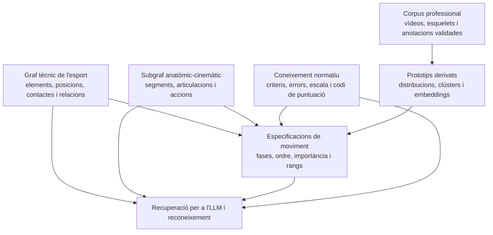

# Arquitectura del coneixement anatòmic, cinemàtic i d'execució d'IA Train

> **Estat del document:** arquitectura canònica; primera fase del subgraf anatòmic-cinemàtic implementada
> **Actualitzat:** 21 d'agost de 2026
> **Abast:** anatomia funcional, descripció cinemàtica dels elements, corpus professional multivídeo, criteris d'execució i reconeixement futur.  
> **Implementació actual:** vocabulari anatòmic-cinemàtic, musculatura, relacions tipades, esquelet canònic mesurable versionat i biomecànica funcional validats editorialment per a proves internes. Encara no hi ha mapatge de trackers, especificacions d'elements, corpus, biomecànica quantitativa ni capa normativa.

## 1. Propòsit

Aquest document defineix com IA Train haurà d'incorporar coneixement anatòmic i cinemàtic perquè un element no sigui només un nom, una descripció o una notació. L'objectiu és que el sistema pugui entendre professionalment:

- quins segments corporals intervenen en cada element;
- quines accions articulars es produeixen;
- en quin ordre i en quina fase passen;
- quines accions són definitòries i quines només són variables d'execució;
- com es comporten aquestes variables en múltiples execucions reals;
- què permet identificar l'element;
- què permet valorar si està ben o mal executat;
- com relacionar aquesta informació amb el codi de puntuació;
- com recuperar-la perquè l'LLM pugui conversar i raonar tècnicament.

Tot el que es descriu aquí forma part de la **base professional comuna**. Encara no és personalització. Les preferències d'un entrenador, les adaptacions per a un gimnasta o els patrons particulars d'un club s'afegiran posteriorment com a capes privades o organitzatives connectades a aquesta base.

Aquest document amplia [`arquitectura_base_coneixement_iatrain.md`](arquitectura_base_coneixement_iatrain.md). En cas de conflicte, aquell document continua sent l'autoritat sobre l'arquitectura general i aquest ho és sobre el subsistema anatòmic-cinemàtic.

L'estat exacte del que ja s'ha construït, les fronteres entre models i l'ordre operatiu dels passos següents es documenten a [`implementacio_graf_anatomic_esquelet_cinematic_iatrain.md`](implementacio_graf_anatomic_esquelet_cinematic_iatrain.md). Aquest document d'arquitectura governa la direcció; el document d'implementació governa l'inventari actual.

La implementació muscular i biomecànica funcional es detalla a [`implementacio_capa_biomecanica_iatrain.md`](implementacio_capa_biomecanica_iatrain.md).

## 2. Decisió principal

El coneixement anatòmic-cinemàtic s'ha de tractar com un **subgraf professional diferenciat**, connectat al graf tècnic de trampolí, però no cal separar-lo inicialment en una altra base de dades o tecnologia.

La independència ha de ser:

- **semàntica:** té vocabulari i regles pròpies;
- **editorial:** els conceptes anatòmics, els patrons de moviment i els criteris normatius poden tenir processos de revisió diferents;
- **evolutiva:** es pot ampliar sense redefinir els elements;
- **reutilitzable:** una acció com la flexió de maluc pot participar en molts elements i disciplines;
- **consultable conjuntament:** ha de ser possible passar d'un element als moviments que el defineixen i als criteris que en valoren l'execució.

No es recomana crear ara dos sistemes físicament aïllats. Una segona base grafal o un servei separat complicaria la integritat, la versió, els permisos i la recuperació per a l'LLM sense aportar encara un benefici justificat. La separació física es podrà considerar si el volum o els patrons de consulta ho exigeixen.

També és important utilitzar el terme **anatòmic-cinemàtic**. Un esquelet estimat a partir de vídeo descriu posició, orientació i moviment dels segments. No permet deduir directament activació muscular, forces internes, càrregues articulars o lesions sense models biomecànics addicionals.

### 2.1. Decisió sobre les fases

Les fases de sortida, execució, obertura i aterratge **no es modelaran inicialment com a `KnowledgeConcept` del graf tècnic**. Són una organització temporal de cada element i viuran com a parts ordenades de la seva futura `ElementMotionSpecification`.

El graf tècnic continuarà definint la identitat de l'element. L'especificació de moviment li donarà significat corporal i temporal. El subgraf anatòmic-cinemàtic aportarà els conceptes reutilitzables —segments, articulacions i accions— als quals podrà fer referència cada fase.

La decisió es podrà revisar si apareix un cas real que necessiti tractar una fase genèrica com un concepte independent. No s'ha de promocionar una etiqueta de fase a node només per poder-la dibuixar al visor.

## 3. Dominis de la base professional comuna



### 3.1. Graf tècnic de l'esport

**Estat: primera versió implementada.**

Continua sent propietari de la identitat esportiva:

- element concret;
- posició;
- contactes de sortida i arribada;
- rotació transversal i longitudinal;
- notació;
- prerequisits, progressions i altres relacions professionals.

Respon principalment: **quin element és i quina estructura esportiva el defineix?**

### 3.2. Subgraf anatòmic-cinemàtic

**Estat: primera base implementada a l'app `iatrain_motion`.**

Contindrà conceptes reutilitzables, independents d'un element concret:

- segments corporals;
- articulacions;
- accions articulars;
- eixos i plans;
- configuracions i qualitats corporals;
- esdeveniments cinemàtics reutilitzables que tinguin significat independent d'un element.

Respon: **quines parts del cos es mouen, com es mouen i com es relacionen?**

La implementació separa un codi semàntic estable del nom visible i diferencia els tipus `segment`, `joint`, `joint_action`, `plane`, `axis`, `body_configuration` i `kinematic_event`. Les arestes permeses tenen domini i rang controlats: jerarquia segmentària, segments proximal i distal d'una articulació, articulació d'una acció, pla i eix principals i oposició entre accions.

La lateralitat no duplica els conceptes genèrics. `hip_joint` és una estructura parella i `hip_flexion` una acció reutilitzable; els costats esquerre i dret s'instancien a l'esquelet canònic o al registre futur que apliqui l'acció. Això evita mantenir dues ontologies paral·leles que només difereixen pel costat.

La llavor inicial crea coneixement en estat `draft` i és idempotent. Inclou plans i eixos anatòmics, jerarquia funcional dels principals segments, articulacions de tronc i extremitats i accions articulars bàsiques. No es valida automàticament: cada node i relació conserva autoria i procedència i passa pel mateix govern editorial auditat de la base professional.

### 3.3. Especificació professional de moviment

**Estat: dissenyada, no implementada.**

És el pont entre l'element tècnic i el vocabulari anatòmic-cinemàtic. Descriu cada element en fases ordenades i indica quines accions, segments i magnituds són rellevants a cada fase.

Respon: **com es desenvolupa corporalment aquest element al llarg del temps?**

### 3.4. Coneixement normatiu d'execució

**Estat: dissenyat, no implementat.**

Descriu què considera correcte o incorrecte el codi de puntuació, amb criteris i versions explícites. Ha d'estar separat de la identitat de l'element.

Respon: **com de bé s'ha executat i segons quina norma?**

### 3.5. Corpus professional multivídeo

**Estat: font disponible externament; integració no implementada.**

Conté les execucions de referència, les seqüències d'esquelet, les anotacions i els artefactes derivats. No és un graf de frames: és l'evidència empírica que permet construir i contrastar les especificacions professionals.

Respon: **en quines observacions reals es basa aquesta representació?**

## 4. Què ha de ser node i què no

El graf ha de representar coneixement semàntic reutilitzable. Les sèries temporals i els valors massius necessiten altres estructures.

| Informació | Representació recomanada | Motiu |
|---|---|---|
| `Maluc`, `Genoll`, `Tronc` | Node anatòmic | Conceptes estables i reutilitzables |
| `Flexió de maluc`, `Extensió de genoll` | Node d'acció | Es poden relacionar amb molts elements i criteris |
| `Pla transversal`, `Eix longitudinal` | Node o concepte controlat | Dona significat professional a la rotació |
| `Sortida`, `Execució`, `Obertura`, `Aterratge` | Parts o codis controlats dins de `ElementMotionSpecification` | Organitzen temporalment cada element; no són nodes del graf tècnic per defecte |
| Fase 3 d'una especificació concreta de Barani | Registre ordenat | Té ordre, durada i paràmetres propis d'aquella especificació |
| Importància d'una acció dins d'una fase | Relació enriquida o registre | Necessita rol, pes, rang i justificació |
| Coordenada del canell al frame 127 | Sèrie temporal | No aporta valor com a node i generaria volum desmesurat |
| Seqüència completa d'esquelet | Artefacte de dades | Necessita emmagatzematge eficient i versionat del tracker |
| Embedding temporal | Vector derivat | Serveix per recuperar o classificar, no és coneixement semàntic |
| Valoració d'una execució concreta | Avaluació vinculada al vídeo | És una observació sobre un cas, no una propietat universal |

No s'han de crear nodes per a cada frame, articulació observada o angle calculat. El graf explicaria el significat; les estructures cinemàtiques conservarien les mesures.

Tampoc s'han de crear automàticament nodes per a les fases. `ElementMotionSpecification` serà un model professional estructurat amb una relació directa al `KnowledgeConcept` de l'element. Les seves fases seran registres fills ordenats. Podran referenciar conceptes anatòmics o errors, però no necessiten ser nodes per fer-ho.

## 5. Esquema anatòmic canònic

**Estat: primera versió funcional implementada a `iatrain_motion`.**

El vocabulari defineix què és un maluc o una flexió; `SkeletonSchema` en crea una instanciació mesurable, versionada i independent del tracker. La llavor `iatrain_functional_skeleton_1.0.0-draft` conté:

- 30 punts canònics observables, estimats o derivats;
- 17 segments concrets amb lateralitat i eix primari;
- 16 articulacions connectades als segments proximal i distal;
- 24 definicions angulars funcionals amb acció positiva i negativa, pla, eix, mètode i signe;
- sistema global dretà, metre i radiant com a unitats internes i una posició neutra documentada.

Les instàncies `left_hip_joint` o `left_thigh` referencien directament els nodes genèrics `hip_joint` i `thigh`. Abans de validar un esquema, l'auditoria exigeix que la topologia i les accions coincideixin amb les `MotionRelation` validades.

Cada segment declara la capacitat real d'orientació. `long_axis_only` només permet mesurar l'eix entre dos punts i no autoritza a inferir rotació axial. `full_3d` exigeix un tercer punt per definir un pla i construir un marc ortonormal. Aquesta distinció evita atribuir al tracker graus de llibertat que no observa.

Abans d'importar seqüències s'ha de definir un esquema corporal canònic independent de qualsevol detector. El sistema de tracking actual i els futurs models de visió s'hi hauran de mapar.

Exemple conceptual:

```text
CanonicalJoint: left_hip
TrackerMapping:
  provider: sistema_video_actual
  provider_joint: LEFT_HIP
  schema_version: canonical_skeleton_v1
```

L'esquema haurà d'especificar:

- articulacions i segments disponibles;
- connexions topològiques entre articulacions;
- lateralitat;
- convenció d'eixos i orientació;
- unitats;
- sistema de coordenades;
- càlcul dels angles;
- tractament de punts ocults o no fiables;
- diferències entre dades 2D, 2.5D i 3D;
- versió de l'esquema.

La representació professional no ha de dependre de noms interns com MediaPipe, OpenPose o qualsevol model concret. Cada execució sí que ha de conservar quin tracker i quina versió la van generar.

## 6. Especificació de moviment d'un element

Es proposa introduir en el futur una entitat conceptual equivalent a `ElementMotionSpecification`, vinculada a un node `skill` existent.

La vinculació principal no serà una aresta `KnowledgeRelation`, sinó una relació estructural del model, equivalent a una `ForeignKey` cap al `KnowledgeConcept` de l'element. Això reflecteix que l'especificació forma part de la definició professional d'aquell element i necessita ordre, versions, rangs i validacions que una aresta simple no conté.

Una especificació hauria de tenir:

- element i variant exactes;
- versió i estat editorial;
- posició, direcció i contactes aplicables;
- fases ordenades;
- criteri utilitzat per delimitar cada fase;
- accions anatòmiques per fase;
- segment o articulació afectats;
- rol i importància relativa de cada acció;
- rangs cinemàtics esperats i variabilitat;
- relació amb criteris normatius;
- corpus i prototips que la sustenten;
- autoria, procedència i justificació.

Una possible descomposició professional d'un Barani seria:

```text
Barani
 ├── 1. Contacte i impuls
 │    ├── extensió de genoll
 │    ├── extensió de maluc
 │    └── control de l'alineació del tronc
 ├── 2. Iniciació de la rotació
 │    ├── orientació del tronc
 │    └── inici del gir longitudinal
 ├── 3. Configuració i desenvolupament del vol
 │    ├── accions que creen o mantenen la posició
 │    └── rotació transversal i longitudinal acumulada
 ├── 4. Obertura i preparació de l'arribada
 │    ├── extensió o canvi de configuració
 │    └── orientació visual i corporal
 └── 5. Recepció
      ├── alineació
      ├── absorció del contacte
      └── control final
```

Aquesta descomposició és només il·lustrativa. Les fases, accions i importàncies reals s'hauran de definir amb criteri professional i validar contra el corpus. No s'han d'importar com a veritat a partir d'aquest exemple.

La base professional completa quedarà així:

```text
KnowledgeConcept de l'element
  ├── relacions tècniques estables al graf
  ├── perfil estructurat de rotació i notació
  └── ElementMotionSpecification
       ├── fase de sortida
       ├── fase d'execució
       ├── fase d'obertura
       └── fase d'aterratge
            └── referències a accions, errors i criteris professionals
```

El visor podrà projectar aquesta estructura com un graf navegable, però el sistema persistent continuarà distingint nodes semàntics, relacions simples i especificacions estructurades.

### 6.1. Importància dins de cada fase

No totes les accions observades defineixen l'element ni tenen la mateixa rellevància. La connexió entre fase i acció hauria de poder expressar:

- `identity_defining`: imprescindible per reconèixer l'element;
- `execution_critical`: determinant per a una bona execució;
- `supporting`: contribueix al moviment, però admet variació;
- `incidental`: apareix en alguns exemples i no és normativa;
- importància o pes professional;
- rang temporal dins de la fase;
- confiança i evidència disponible.

Aquests valors no s'han de deduir només per freqüència estadística. Una acció pot aparèixer en molts vídeos i continuar sent un hàbit tècnic, una compensació o un error.

## 7. Corpus professional basat en múltiples vídeos

La representació de cada element ha de provenir d'un conjunt d'execucions, no d'un únic exemple. Es proposa una estructura equivalent a:

```text
ElementReferenceSet
 ├── ReferenceExecution 1
 │    ├── vídeo
 │    ├── PoseSequence
 │    ├── anotacions de fase
 │    ├── etiqueta d'identitat
 │    └── avaluació d'execució
 ├── ReferenceExecution 2
 ├── ReferenceExecution 3
 └── DerivedMotionPrototype 1..N
```

### 7.1. Conjunt de referència

Un conjunt de referència haurà de registrar:

- element i variant;
- criteris d'inclusió i exclusió;
- fonts i drets d'ús;
- responsables de la selecció i validació;
- diversitat de gimnastes i condicions;
- distribució de qualitats d'execució;
- versions del sistema d'anàlisi;
- data i estat editorial;
- versió del codi de puntuació utilitzat per etiquetar.

### 7.2. Execució de referència

Cada vídeo haurà de conservar separadament:

- vídeo original o referència segura al fitxer;
- identificador anonimitzat de l'executant quan sigui necessari;
- freqüència de frames i durada;
- càmera, perspectiva i calibratge conegut;
- tracker, versió del model i configuració;
- seqüència de punts i confiança per articulació;
- transformacions de normalització;
- element assignat i confiança de l'etiqueta;
- fases anotades manualment o automàticament;
- valoració d'execució i desglossament per criteris;
- revisors i desacords;
- artefactes derivats i versió del pipeline.

### 7.3. Composició del corpus

El corpus no ha d'incloure només execucions perfectes. Per separar identificació i qualitat necessita:

- execucions excel·lents;
- execucions correctes;
- execucions deficients però encara identificables;
- diferents morfologies i estils legítims;
- diferents alçades i temps de vol;
- elements visualment o cinemàticament semblants;
- moviments incomplets, ambigus i exemples negatius.

Una mala execució de Barani pot continuar essent un Barani. Si el corpus només conté exemples excel·lents, el reconeixedor podria confondre qualitat baixa amb identitat diferent.

## 8. Prototips: distribucions, no un vídeo mitjà

De cada conjunt es podran derivar un o diversos prototips. No s'ha de calcular simplement una mitjana frame a frame, perquè les execucions tenen durades diferents i la mitjana pot produir una trajectòria que cap gimnasta realitza.

Els prototips haurien de conservar:

- seqüència de fases normalitzada;
- durada relativa i variabilitat de cada fase;
- distribucions d'angles i velocitats;
- rotació acumulada per eix;
- orientació dels segments;
- trajectòria relativa del centre corporal;
- moments cinemàtics significatius;
- intervals de confiança;
- embedding temporal per a recuperació o classificació;
- nombre i identitat de les execucions que els sustenten;
- versió de l'algoritme que els ha generat.

Pot haver-hi diversos prototips vàlids per al mateix element si apareixen clústers tècnics consistents. Aquests clústers no s'han d'interpretar automàticament com a «bo» i «dolent»: poden representar variació legítima, morfologia, perspectiva o un biaix del conjunt.

## 9. Separar identitat de l'element i qualitat d'execució

Aquesta és una frontera obligatòria del disseny.

### 9.1. Identitat

La identificació respon: **quin element o moviment s'ha produït?**

Es basa principalment en:

- contactes inicial i final;
- rotació transversal;
- direcció;
- girs longitudinals i ordre;
- posició;
- estructura i ordre de fases;
- trets cinemàtics definitoris.

El resultat ha d'incloure element candidat, alternatives, confiança i evidència. La qualitat no pot substituir l'etiqueta d'identitat.

### 9.2. Execució

L'avaluació respon: **com de bé s'ha realitzat segons un estàndard concret?**

Es basa en:

- criteris del codi de puntuació;
- fase on aplica cada criteri;
- desviació respecte dels rangs professionals;
- errors observables;
- severitat;
- versió normativa.

La futura escala entera de 0 a 5 no s'ha de desar com un significat universal i descontextualitzat. Cal una rúbrica versionada que indiqui:

- què significa cada nivell;
- sobre quin criteri s'aplica;
- com es combinen criteris;
- quina versió del codi la defineix;
- quins valors són anotació humana i quins són estimació automàtica.

Exemple de resposta estructurada futura:

```json
{
  "identity": {
    "element": "Barani agrupat",
    "confidence": 0.94,
    "alternatives": []
  },
  "execution": {
    "standard": "code_version_x",
    "overall_level": 3,
    "criteria": {
      "body_position": 4,
      "alignment": 2,
      "opening": 3,
      "landing_control": 3
    }
  }
}
```

Els noms dels criteris i la forma d'agregació són il·lustratius fins que es modeli el codi real.

## 10. Coneixement normatiu i codi de puntuació

El codi de puntuació forma part de la base professional, però no s'ha de barrejar amb l'estat editorial del graf.

Caldrà representar:

- document o font normativa;
- versió i període de vigència;
- disciplina i nivell d'aplicació;
- criteris d'execució;
- errors i deduccions;
- excepcions;
- escala de valoració;
- relació amb fases, accions i elements;
- canvis respecte de versions anteriors.

Un concepte pot ser professionalment vàlid i no estar permès en una competició determinada. Igualment, una característica pot ajudar a reconèixer un element sense ser penalitzada, o pot ser penalitzable sense canviar-ne la identitat.

La informació derivada dels vídeos i la derivada del codi s'han de citar separadament:

- el codi defineix criteris i conseqüències normatives;
- el corpus mostra com es manifesta el moviment en execucions reals;
- la interpretació professional connecta tots dos dominis.

## 11. Recuperació per a l'LLM

L'LLM no ha de rebre totes les coordenades dels vídeos ni intentar reconstruir el moviment directament des de milers de frames. Haurà de recuperar un paquet semàntic adaptat a la conversa.

Per a una pregunta sobre un Barani, el paquet podria contenir:

```json
{
  "element": {
    "name": "Barani agrupat",
    "rotation": {},
    "contacts": {},
    "position": "tuck"
  },
  "motion_specification": {
    "phases": [],
    "identity_defining_actions": [],
    "execution_critical_actions": [],
    "expected_ranges": []
  },
  "execution_standard": {
    "version": "...",
    "criteria": [],
    "common_errors": []
  },
  "evidence_summary": {
    "reference_execution_count": 0,
    "prototype_versions": [],
    "limitations": []
  }
}
```

A partir d'aquest paquet, l'LLM podrà:

- explicar l'element fase per fase;
- diferenciar les accions essencials de les variables;
- relacionar un error amb el segment i la fase corresponents;
- justificar per què un vídeo sembla un element concret;
- explicar una valoració d'execució;
- relacionar posteriorment errors amb tasques d'entrenament;
- declarar incertesa quan el corpus o el vídeo no siguin suficients.

L'LLM és responsable de la conversa i l'explicació. El tracking, la segmentació, el càlcul d'angles, la comparació de prototips i l'aplicació de regles han de ser processos deterministes o models especialitzats amb sortida estructurada.

## 12. Flux futur de reconeixement de vídeo

```mermaid
flowchart LR
    V["Vídeo"] --> S["Detecció i seguiment de l'esquelet"]
    S --> Q["Control de qualitat i confiança"]
    Q --> Z["Normalització espacial i temporal"]
    Z --> G["Segmentació en moviments i fases"]
    G --> F["Extracció de trets i embedding"]
    F --> R["Recuperació de candidats"]
    R --> K["Restriccions del graf tècnic"]
    K --> I["Identitat i confiança"]
    I --> E["Avaluació d'execució separada"]
    E --> X["Explicació contextual de l'LLM"]
```



El graf tècnic permetrà descartar combinacions incompatibles. L'especificació cinemàtica permetrà comparar el desenvolupament temporal. La capa normativa permetrà valorar l'execució després d'haver resolt la identitat.

El sistema també haurà de poder descriure moviments no classificats completament:

```text
4 quarts endavant + 1 mig gir longitudinal + contacte final dempeus
posició probable: agrupada
element candidat: Barani agrupat
confiança limitada per oclusió del tronc
```

## 13. Frontera amb la personalització futura

Tot el següent pertany a la base professional comuna:

- vocabulari anatòmic;
- topologia de l'esquelet canònic;
- accions professionals i especificacions de fase dels elements;
- especificacions validades dels elements;
- corpus de referència autoritzat;
- prototips professionals;
- criteris i rúbriques del codi;
- relacions entre elements, fases, accions i errors normatius.

No són coneixement professional comú:

- «jo prefereixo ensenyar el Barani d'aquesta manera»;
- toleràncies pròpies d'un entrenador;
- exercicis privats o consignes locals;
- patró cinemàtic habitual d'un gimnasta;
- adaptacions temporals per fatiga, por o lesió;
- valoracions no contrastades d'una única persona.

Aquest contingut formarà part de capes posteriors i podrà apuntar als mateixos elements, fases, accions o criteris. No podrà modificar silenciosament la definició professional comuna.

Concretament, un futur `TrainingTask` d'un entrenador podrà referenciar:

- el `KnowledgeConcept` de l'element que treballa;
- una fase concreta de la seva `ElementMotionSpecification`;
- una acció anatòmica professional;
- un error o criteri d'execució.

La tasca i la metodologia continuaran a la capa de personalització. Les seves referències no les convertiran en nodes del graf professional.

## 14. Govern editorial, procedència i privacitat

Els nous conceptes i especificacions hauran de seguir el mateix principi `draft`, `validated` i `retired`, amb algunes necessitats addicionals:

- versió de l'esquema anatòmic;
- versió del tracker i del pipeline;
- versió del corpus;
- versió del prototip derivat;
- versió del codi de puntuació;
- traça dels vídeos que sustenten una conclusió;
- revisors professionals;
- desacords i incertesa;
- possibilitat de reproduir el càlcul.

Els vídeos i esquelets poden ser dades biomètriques o personals. Formar part del corpus professional no elimina la necessitat de:

- consentiment i base jurídica adequats;
- control d'accés;
- anonimització o pseudonimització;
- política de retenció;
- registre de drets d'ús;
- separació entre el fitxer original i els artefactes professionals derivats.

Un prototip agregat pot formar part de la base comuna encara que els vídeos originals continuïn tenint accés restringit.

## 15. Passos futurs recomanats

### Pas 1. Inventariar el sistema de vídeo existent

Documentar abans de modelar:

- format d'entrada i sortida;
- articulacions detectades;
- 2D o 3D;
- confiança i oclusions;
- freqüència temporal;
- identificació de contacte amb la lona;
- normalitzacions actuals;
- formats d'emmagatzematge;
- volum esperat;
- dades i anotacions ja disponibles.

### Pas 2. Definir l'esquelet canònic — primera versió implementada

La primera especificació versionada ja existeix. El pas pendent és mapar-hi el tracker real i validar experimentalment quins angles i orientacions permet calcular amb fiabilitat.

### Pas 3. Escollir un tall vertical

Començar amb un element ben conegut —per exemple, una variant concreta de Barani— i un conjunt petit però divers de vídeos validats. No intentar modelar tot el catàleg alhora.

### Pas 4. Definir el vocabulari mínim — implementat

Introduir només els segments, articulacions, accions i eixos necessaris per descriure aquell tall vertical. Definir les fases com a parts ordenades de l'especificació de l'element i evitar construir una ontologia anatòmica completa sense casos d'ús.

### Pas 5. Importar les execucions sense perdre informació

Conservar vídeo, esquelet, confiança, calibratge, tracker i transformacions. La importació ha de ser idempotent i no ha de validar automàticament l'etiqueta de l'element.

### Pas 6. Anotar identitat, fases i qualitat per separat

Fer que els revisors indiquin:

- quin element és;
- on comencen i acaben les fases;
- quines accions són rellevants;
- quina qualitat té segons cada criteri;
- quina confiança tenen en cada anotació.

### Pas 7. Construir la primera especificació professional

Vincular una `ElementMotionSpecification` al node de l'element, crear-ne les fases ordenades i referenciar-hi les accions validades. Distingir trets definitoris, crítics per a l'execució i merament variables.

### Pas 8. Derivar i validar prototips

Generar distribucions i embeddings reproduïbles. Comparar-los amb execucions excloses de l'entrenament i revisar si els clústers representen variació legítima o biaixos.

### Pas 9. Modelar una primera rúbrica normativa

Seleccionar pocs criteris del codi de puntuació, versionar-los i provar l'escala 0–5 sense barrejar-la amb la identitat.

### Pas 10. Provar la recuperació per a l'LLM

Generar el paquet semàntic d'un element i comprovar que permet respondre preguntes tècniques sense enviar les sèries temporals completes.

### Pas 11. Provar reconeixement i explicació

Mesurar per separat:

- exactitud d'identificació;
- calibratge de la confiança;
- segmentació de fases;
- concordança de l'avaluació d'execució;
- qualitat i fidelitat de les explicacions de l'LLM.

### Pas 12. Expandir progressivament

Afegir elements veïns i reutilitzar el vocabulari existent. Crear nous nodes anatòmics només quan aparegui un concepte realment nou.

## 16. Decisions que s'han de resoldre abans de les fases següents

- format exacte del tracker i qualitat real de les coordenades;
- necessitat de dades 3D o ús acceptable de 2D;
- mapatge exacte entre l'esquelet canònic i els punts disponibles al tracker real;
- criteri professional de divisió en fases;
- unitat d'una especificació: element, variant de posició o combinació més concreta;
- nombre mínim i diversitat requerida de vídeos;
- procés de revisió i acord entre experts;
- definició exacta de l'escala 0–5;
- model de versions del codi de puntuació;
- emmagatzematge de vídeos, sèries temporals i embeddings;
- tractament legal i drets d'ús del corpus;
- mètriques d'acceptació per al reconeixement i l'avaluació.

## 17. Regles per a futurs agents

1. No convertir frames o coordenades en nodes.
2. No confondre freqüència observada amb correcció professional.
3. No derivar una definició d'un únic vídeo.
4. No construir un únic «moviment mitjà» quan existeixin variants legítimes.
5. No barrejar identificació de l'element amb qualitat d'execució.
6. No atribuir al codi de puntuació conclusions que provenen del corpus, ni a l'inrevés.
7. No tractar una escala 0–5 com a universal sense criteri i versió.
8. No fer que l'LLM calculi angles o reconstrueixi seqüències si existeix un pipeline especialitzat.
9. Conservar sempre procedència, versió, confiança i limitacions.
10. Mantenir aquest coneixement comú separat de preferències i adaptacions personals.
11. Proposar canvis professionals com a esborranys sotmesos a revisió.
12. Començar per talls verticals validables abans d'ampliar l'ontologia.
13. No modelar les fases com a `KnowledgeConcept` del graf tècnic sense un cas d'ús independent que ho justifiqui.
14. No confondre el graf amb tota la base de coneixement: les especificacions estructurades també són coneixement professional comú.

## 18. Resum de la decisió arquitectònica

IA Train tindrà un subgraf anatòmic-cinemàtic professional connectat al graf tècnic de l'esport. Els nodes representaran conceptes reutilitzables; una `ElementMotionSpecification` vinculada a cada element contindrà les fases ordenades i descriurà com s'executa corporalment; el corpus multivídeo aportarà evidència; els prototips conservaran variació real; i la normativa versionada permetrà valorar l'execució sense confondre-la amb la identitat.

L'LLM no «veurà» un Barani només com una descripció textual. Recuperarà la seva identitat tècnica, les fases, les accions anatòmiques importants, els rangs cinemàtics, els criteris normatius i un resum de l'evidència. Les capes personals s'afegiran després, connectades a aquesta base comuna però sense alterar-la.
