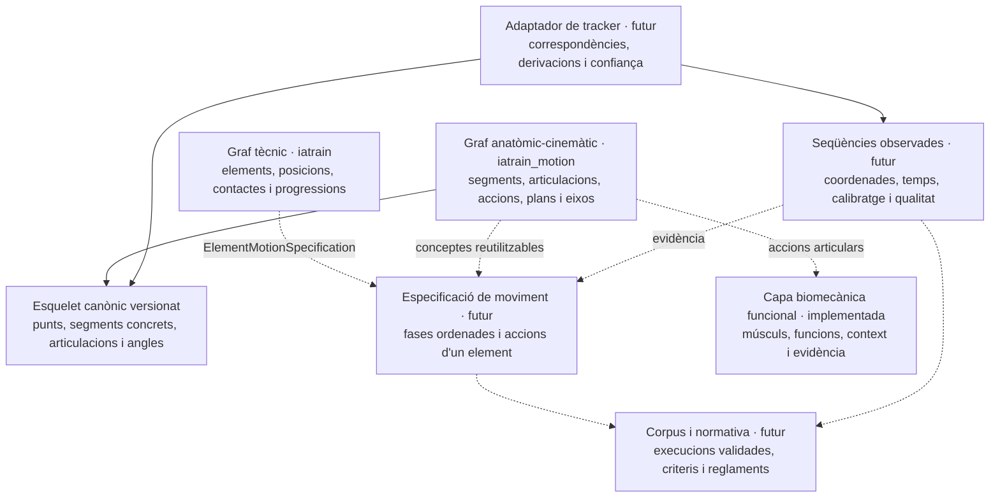

# Implementació del graf anatòmic-cinemàtic i l'esquelet canònic d'IA Train

> **Estat del document:** registre canònic de la implementació actual  
> **Actualitzat:** 20 d'agost de 2026
> **Abast implementat:** vocabulari anatòmic-cinemàtic i muscular, relacions semàntiques, esquelet funcional canònic, biomecànica funcional, govern editorial, llavors de dades i visualització dels subgrafs.
> **Fora de l'abast actual:** mapatge de trackers, seqüències observades, especificacions temporals d'elements, corpus, normativa i biomecànica quantitativa. La musculatura i la biomecànica funcional ja estan implementades i es documenten a [`implementacio_capa_biomecanica_iatrain.md`](implementacio_capa_biomecanica_iatrain.md).

## 1. Propòsit

Aquest document deixa constància de què s'ha construït i de com s'ha d'ampliar. Complementa:

- [`arquitectura_base_coneixement_iatrain.md`](arquitectura_base_coneixement_iatrain.md), que governa la base de coneixement completa;
- [`arquitectura_coneixement_anatomic_cinematic_iatrain.md`](arquitectura_coneixement_anatomic_cinematic_iatrain.md), que defineix l'arquitectura anatòmica, cinemàtica, normativa i de corpus a llarg termini.

L'objectiu d'aquesta primera implementació és donar a IA Train dues coses diferents però connectades:

1. **significat anatòmic reutilitzable:** saber què són una cuixa, un maluc, una flexió o un eix longitudinal;
2. **un contracte corporal mesurable:** saber quins punts, segments, articulacions i angles formen una representació canònica del cos, independent del detector de vídeo.

Aquesta base permetrà descriure seqüències de moviment i relacionar-les amb els elements tècnics sense lligar el coneixement professional a MediaPipe, MoveNet o cap tracker concret. Encara no permet inferir activació muscular, forces, càrregues articulars, risc de lesió ni qualitat normativa d'una execució.

## 2. Decisió d'estructura

La base és **híbrida**. No tota la informació és un node o una aresta.

| Tipus d'informació | Representació | Criteri |
|---|---|---|
| Concepte anatòmic reutilitzable | Node `MotionConcept` | Té identitat i significat estable entre molts elements |
| Relació anatòmica estable | Aresta `MotionRelation` | Expressa semàntica reutilitzable amb domini i rang controlats |
| Instanciació corporal mesurable | Models relacionals de l'esquelet canònic | Necessita versió, topologia, unitats, geometria i restriccions fortes |
| Punt produït per un tracker concret | Futur mapatge de tracker | És una correspondència de proveïdor, no coneixement anatòmic universal |
| Coordenades de cada frame | Futura sèrie temporal o artefacte extern | És dada massiva observada, no un node del graf |
| Fases d'un element concret | Futura especificació estructurada i ordenada | L'ordre temporal pertany a aquell element |
| Criteri de correcció o penalització | Futura capa normativa versionada | Pot canviar segons reglament i no defineix la identitat anatòmica |

La implementació viu a l'app Django `iatrain_motion`, dins de la mateixa base PostgreSQL que la resta d'IA Train. La separació actual és semàntica, editorial i modular; no és una separació física en una altra base de dades.

## 3. Capes del sistema



### 3.1. Graf tècnic de l'esport

Continua vivint a `iatrain` mitjançant `KnowledgeConcept` i `KnowledgeRelation`. Defineix la identitat esportiva: quin element és, quina posició o contacte té i quines relacions tècniques manté.

### 3.2. Graf anatòmic-cinemàtic

Viu a `iatrain_motion` mitjançant `MotionConcept` i `MotionRelation`. Defineix el vocabulari corporal reutilitzable, independent dels elements concrets i dels trackers.

### 3.3. Esquelet canònic mesurable

També viu a `iatrain_motion`, però no es força a ser un graf semàntic. És un agregat relacional versionat encapçalat per `SkeletonSchema`. Instancia els conceptes genèrics amb costat, punts i definicions geomètriques concretes.

Per exemple:

```text
MotionConcept hip_joint
    └── CanonicalJoint left_hip_joint
            ├── centre: left_hip_center
            ├── segment proximal: pelvis
            └── segment distal: left_thigh

MotionConcept hip_flexion
    └── JointAngleDefinition left_hip_flexion_extension
            ├── acció positiva: hip_flexion
            ├── acció negativa: hip_extension
            ├── pla: sagittal_plane
            └── eix: mediolateral_axis
```

### 3.4. Capes encara no implementades

- **Adaptador de tracker:** traduirà els punts reals d'un proveïdor al contracte canònic.
- **Seqüències observades:** conservaran coordenades per frame, temps, confiança, calibratge i transformacions.
- **Especificacions de moviment:** connectaran cada `KnowledgeConcept` d'element amb fases ordenades i conceptes de `iatrain_motion`.
- **Biomecànica funcional i músculs:** implementats a `iatrain_biomechanics`; connecten músculs, accions, estabilitzacions, context i evidència sense inferir activació real.
- **Corpus professional:** aportarà múltiples execucions revisades i la seva variabilitat real.
- **Normativa:** representarà criteris, errors i reglaments versionats.

## 4. Models implementats

### 4.1. `MotionConcept`

Representa un node semàntic. Té `code` estable, nom, definició, tipus, lateralitat conceptual, estat editorial, autoria i procedència.

Tipus disponibles:

- `segment`;
- `joint`;
- `joint_action`;
- `plane`;
- `axis`;
- `body_configuration`;
- `kinematic_event`.

La lateralitat només classifica segments i articulacions: `paired`, `midline`, `unpaired` o `not_applicable`. Els conceptes d'acció, pla i eix són genèrics i no es dupliquen per costat.

### 4.2. `MotionRelation`

Representa una aresta tipada. Les relacions implementades són:

- `part_of`;
- `proximal_segment`;
- `distal_segment`;
- `action_at_joint`;
- `primary_plane`;
- `primary_axis`;
- `opposite_of`.

Cada tipus controla quins tipus de node pot unir. Les relacions funcionals que només poden tenir un destí —per exemple, l'articulació principal d'una acció— tenen unicitat reforçada a la base de dades.

### 4.3. `SkeletonSchema`

És el contracte versionat de mesura. Defineix:

- codi i versió semàntica;
- dimensionalitat;
- unitats internes: metre i radiant;
- sistema de coordenades;
- convenció dels marcs locals dels segments;
- posició neutra;
- autoria, procedència i estat editorial.

La versió actual és `iatrain_functional_skeleton` / `1.0.0-draft`, tridimensional i amb sistema de coordenades dretà.

### 4.4. `CanonicalLandmark`

Defineix punts canònics com centres articulars, punts anatòmics, terminals o virtuals. Cada punt declara si és:

- `observed`: observable o directament mapable;
- `estimated`: centre o referència estimada;
- `derived`: calculat a partir d'altres punts amb una regla explícita.

Els punts derivats guarden mètode i entrades. Això evita ocultar una estimació com si fos una observació directa.

### 4.5. `CanonicalSegment`

Instancia un `MotionConcept` de tipus segment i hi afegeix:

- costat concret;
- punt inicial i final de l'eix principal;
- tercer punt opcional per definir el pla local;
- eix primari;
- capacitat geomètrica real.

La capacitat és `long_axis_only` o `full_3d`. Un segment `long_axis_only` no autoritza a inferir rotació axial. Un segment `full_3d` necessita un tercer punt fix al mateix segment per construir un marc ortonormal.

En la llavor actual, cap i cintura escapular es declaren honestament com `long_axis_only`; pelvis, tronc i peus poden tenir orientació 3D quan els punts necessaris són disponibles.

### 4.6. `CanonicalJoint`

Instancia un `MotionConcept` de tipus articulació i connecta:

- costat;
- centre articular;
- segment proximal;
- segment distal.

La topologia ha de pertànyer al mateix `SkeletonSchema` i respectar la lateralitat del concepte genèric.

### 4.7. `JointAngleDefinition`

Defineix com interpretar una component angular d'una articulació. Inclou:

- articulació canònica;
- component: flexió-extensió, abducció-adducció o rotació axial;
- accions positiva i negativa;
- pla i eix anatòmics;
- mètode de càlcul;
- ordre de la component;
- convenció explícita de signe.

No és una mesura d'un vídeo. És la definició estable que permetrà calcular i interpretar mesures futures.

## 5. Contingut inicial creat

### 5.1. Vocabulari `functional_anatomy_v1`

La llavor anatòmica crea, en estat `draft`:

- **169 nodes totals:** 13 segments, 9 articulacions, 40 accions articulars, 3 plans, 3 eixos, 70 músculs i 31 grups musculars;
- **360 relacions** tipades i auditades després de les llavors anatòmica i biomecànica.

No crea nodes `left_*` i `right_*` al vocabulari semàntic. `hip_joint`, per exemple, és un únic concepte parell.

### 5.2. Esquelet `iatrain_functional_skeleton_1.0.0-draft`

La llavor de l'esquelet crea:

- **30 punts canònics**;
- **17 segments concrets**;
- **16 articulacions concretes**;
- **24 definicions angulars**.

Els costats només s'instancien quan l'estructura és parella. Les estructures medials —com pelvis, tronc o cap— mantenen una única instància. Les accions continuen sent genèriques i el costat s'obté de l'articulació o del registre futur que les apliqui.

Aquesta versió és una base funcional per a moviment esportiu, no una descripció clínica completa de tots els ossos, articulacions o graus de llibertat del cos humà.

## 6. Connexió actual entre les capes

La connexió implementada és:

```text
MotionConcept
    ← CanonicalSegment.concept
    ← CanonicalJoint.concept
    ← JointAngleDefinition.(positive_action, negative_action, plane, axis)
```

Això uneix el significat anatòmic amb l'esquelet mesurable. Les auditories comproven que articulacions, segments i accions concordin amb les `MotionRelation` requerides.

El graf tècnic `iatrain` i el graf anatòmic `iatrain_motion` encara **no tenen una relació semàntica persistent entre un element i les seves accions corporals**. Actualment:

- comparteixen base de dades, identitat editorial i convencions de govern;
- es poden seleccionar com dues projeccions diferents al visor 3D;
- no s'han connectat artificialment amb arestes genèriques.

El pont correcte serà la futura `ElementMotionSpecification`: apuntarà a l'element tècnic i contindrà fases ordenades que referenciaran accions, segments, articulacions i mètriques anatòmiques.

## 7. Govern editorial i creixement segur

Totes les dades sembrades entren com a `draft`. La llavor no les converteix en veritat professional validada.

El govern implementat aplica aquests principis:

- només una persona autoritzada pot validar, reobrir o retirar contingut;
- les transicions editorials deixen un esdeveniment d'auditoria;
- un esquema validat bloqueja la modificació de les seves definicions filles;
- un esquelet només es pot validar si els conceptes i relacions semàntics necessaris també estan validats;
- no es pot reobrir o retirar una dependència usada per un esquelet validat sense reobrir primer l'esquema;
- les referències d'autoria utilitzen `PROTECT`;
- la fusió de dues identitats `Person` trasllada també l'autoria i validació d'aquest domini;
- una nova versió de l'esquelet pot conviure amb les anteriors en lloc de reescriure mesures històriques.

Les llavors són idempotents:

```powershell
python manage.py seed_motion_vocabulary --author-username <usuari>
python manage.py seed_canonical_skeleton --author-username <usuari>
```

La llavor de l'esquelet només sincronitza definicions seves mentre l'esquema continua en `draft`; no sobreescriu silenciosament un esquema validat o dades que ja no reconeix com a pròpies.

## 8. Visualització i administració

El visor del graf incorpora un selector entre:

- graf tècnic;
- graf anatòmic-cinemàtic.

Aquest selector mostra dues projeccions professionals diferents i evita barrejar els significats. L'esquelet canònic encara no és una tercera projecció gràfica: actualment les seves definicions es poden inspeccionar i gestionar des de l'administració de Django.

## 9. Límits actuals

La implementació està preparada estructuralment per créixer, però encara no s'ha de considerar una ontologia anatòmica completa ni un sistema biomecànic validat. Falta:

- revisió i validació per professionals del domini;
- inventari del tracker real i de la qualitat de les seves coordenades;
- mapatge de punts de proveïdor a punts canònics;
- regles de confiança, oclusió, calibratge i dades absents;
- representació de seqüències, fases i ocurrències d'accions;
- connexió persistent amb elements tècnics;
- corpus multivídeo;
- criteris normatius i reglamentaris;
- validació professional de músculs i funcions; forces, càrregues internes i braços de moment quantitatius;
- ampliació anatòmica guiada per casos d'ús reals.

## 10. Passos futurs recomanats

L'ordre recomanat és el següent:

1. **Revisar professionalment la base actual.** Corregir noms, definicions, topologia, convencions angulars i capacitats geomètriques abans de validar la versió.
2. **Inventariar el tracker real.** Documentar punts disponibles, 2D o 3D, referencial, unitats, confiança, oclusions, interpolacions i versions del pipeline.
3. **Implementar `TrackerSchema` i `TrackerJointMapping`.** Cada correspondència indicarà quin punt del proveïdor alimenta quin `CanonicalLandmark`, o com es deriva, amb versió i procedència.
4. **Normalitzar determinísticament una postura.** Convertir unitats i coordenades, aplicar calibratge, calcular punts derivats i emetre indicadors de qualitat sense inventar graus de llibertat absents.
5. **Fer proves de cobertura.** Mesurar punts canònics resolts, angles calculables, estabilitat temporal i comportament davant oclusions. Afegir anatomia només quan el tracker o un cas d'ús ho justifiqui.
6. **Implementar `ElementMotionSpecification`.** Connectar un element tècnic amb fases ordenades, accions anatòmiques, lateralitat aplicada, mètriques i importància funcional.
7. **Construir un tall vertical.** Descriure una variant exacta i ben delimitada de Barani de cap a cap abans d'expandir el catàleg.
8. **Afegir seqüències i corpus.** Conservar fora del graf les sèries massives i mantenir a PostgreSQL metadades, versions, permisos, anotacions i procedència.
9. **Afegir la capa normativa.** Separar identitat de l'element, patró observat i criteri de bona execució; versionar qualsevol dependència del reglament.
10. **Biomecànica funcional — implementada en `draft`.** Revisar professionalment la llavor descrita a [`implementacio_capa_biomecanica_iatrain.md`](implementacio_capa_biomecanica_iatrain.md) i ampliar condicions o evidència només amb casos verificables. La biomecànica quantitativa i la capa privada d'exercicis continuen sent futures.

## 11. Criteris mínims del futur mapatge de tracker

Abans d'acceptar un adaptador com a fiable, ha de demostrar:

- cobertura explícita de cada `CanonicalLandmark`: directe, derivat o no disponible;
- versió del tracker i del contracte canònic;
- transformació d'unitats i sistema de coordenades reproduïble;
- conservació de confiança, absència i oclusió;
- prohibició de calcular components angulars que la geometria disponible no sosté;
- procedència i fórmules de derivació auditables;
- proves amb seqüències representatives, no només postures ideals.

## 12. Mapa del codi

- `iatrain_motion/models.py`: nodes, arestes i contracte relacional de l'esquelet.
- `iatrain_motion/checks.py`: auditories de coherència semàntica i topològica.
- `iatrain_motion/editorial.py`: transicions, dependències i bloquejos editorials.
- `iatrain_motion/vocabulary.py`: vocabulari anatòmic-cinemàtic inicial.
- `iatrain_motion/skeleton_vocabulary.py`: definició revisable de l'esquelet funcional inicial.
- `iatrain_motion/management/commands/seed_motion_vocabulary.py`: llavor idempotent del subgraf.
- `iatrain_motion/management/commands/seed_canonical_skeleton.py`: llavor idempotent de l'esquelet.
- `iatrain_motion/admin.py`: administració dels conceptes i definicions canòniques.
- `iatrain_motion/migrations/`: esquema persistent i evolució versionada.
- `iatrain_motion/tests/`: contractes de models, govern, llavors i esquelet.
- `iatrain_biomechanics/`: funcions musculars, context, evidència, govern, raonament i llavor biomecànica.
- `iatrain/views/knowledge_graph.py`: projecció tècnica i anatòmica per al visor.
- `iatrain/static/iatrain/knowledge_graph.js`: selector i representació interactiva.

## 13. Regles de continuïtat

1. No duplicar conceptes semàntics per esquerra i dreta; instanciar el costat on correspon.
2. No convertir frames, coordenades o mesures observades en nodes.
3. No confondre l'esquelet canònic amb l'esquema concret d'un tracker.
4. No inferir rotació axial des d'un segment que només defineix l'eix longitudinal.
5. No validar automàticament dades creades per llavor o importació.
6. No connectar elements i anatomia amb arestes vagues; usar una especificació temporal explícita.
7. No barrejar descripció cinemàtica, activació muscular i judici normatiu.
8. No ampliar l'anatomia per exhaustivitat teòrica: ampliar-la amb un tracker o un cas d'ús verificable.
9. Versionar els contractes que afectin la interpretació de mesures històriques.
10. Conservar sempre autoria, procedència i traça editorial.
